## Research Question, Plan, and Conclusions
Hey Sharks, did you know that households in Australia throw out up to $1500 a year down their bins [1]? That is, in the form of food waste. Households discard enough food daily to provide over a billion meals, even as 1 in 11 people go hungry worldwide [2]. 58% of high-wasting households cited food reaching their expiry date as their number one reason for food disposal, suggesting widespread confusion about food safety versus quality indicators and unnecessary wastage of perfectly edible food [1].

These metrics highlight the core of our problem: the need for better awareness on discerning food safety by our own means, understanding the difference between 'use by' and 'best-before', utilizing what we already have in our kitchens, and making better use of the surplus.

In light of these challenges, this study explores an innovative approach: integrating AI assistance into food management systems to encourage sustainable behaviors related to the 12th SDG [3]. Use of AI and digitalizaton can help make inventory-tracking a more engaging and efficient experience that covers all the bases.

This leads to my research question: “What are students’ perceptions of usability, usefulness, and sustainability impact in an AI-assisted food management prototype for reducing food waste?”

### Evaluation Plan
Consent to be recorded was requested beforehand and identifying information has been anonymized. The study starts with a pre-task survey to probe awareness on food waste and responsible consumption. 

Participants were briefed on the functionality of the website, then asked to input 3 food objects as database entries. The food items provided were bread, a carton of eggs, and a can of black pepper. In order to improve immersion, participants were asked to roleplay [4] as if they had shopped for the groceries themselves. The site also comes pre-filled with other ingredients to simulate a pre-stocked kitchen environment. The means by which participants could input the ingredients were left up to individual exploration, to encourage independent evaluation of the UI/UX. Participants were then asked what they'd do with the food they now had in their "kitchen" (current database state), and how they'd deal with surplus. Afterwards, a semi-structured interview was conducted to obtain qualitative data. Lastly, participants were to fill a post-task survey comprising the SUS scale, a short NASA-TLX index, and another post-task probe on responsible consumption. 

## Conclusions 

Overall, students perceived the prototype as highly usable, useful, and impactful in promoting sustainable behaviors. Quantitative results showed strong usability (SUS = 85.5, p < 0.05, d = 1.47) and low workload (NASA-TLX ≈ 2/7), indicating that the system was both efficient and enjoyable to use. The prototype significantly improved users’ inventory awareness (p = 0.002), while qualitative findings revealed meaningful cognitive and behavioral shifts toward more mindful food management and waste reduction. Participants found the interface intuitive and engaging, particularly appreciating features like gesture-based input and ingredient-based recipe suggestions. The limitations found were detection errors (avg precision = 0.807) and dependence on consistent user logging. 

## Prototype Design and Features

WasteWise is a high-fidelity prototype of a website that utilizes computer vision to easily keep track of inventory and when they will soon expire. It's a generalized tool that covers the problems we unearthed in the beginning of this story. In short, it incorporates gesture-based input for user engagement, and matches every type of food in your inventory to a database of expiry information to let you know about its quality indicators and whether it's advisable to consume past expiry. Of course, consumption entails we'd have to make something out of that food, so I also implemented a recipe-generation system. The app also contains details such as location and contact info on where you could donate your food. The expected use case for such an app would be a mobile phone for convenience, but for ease of testing and deployment, the prototype currently lives on my PC's localhost.

You can input a food item into your digital inventory by scanning it with the camera. This app is built on Django and uses YOLO11, a state-of-the-art object detection model trained on a manually-labelled, homemade dataset of 100 pictures of my previous grocery run. You can either take a snapshot of the detected objects via the 'Save Snapshot' button, or do a fun little thumbs-up gesture (non-standard interaction). Look, ma, no hands!

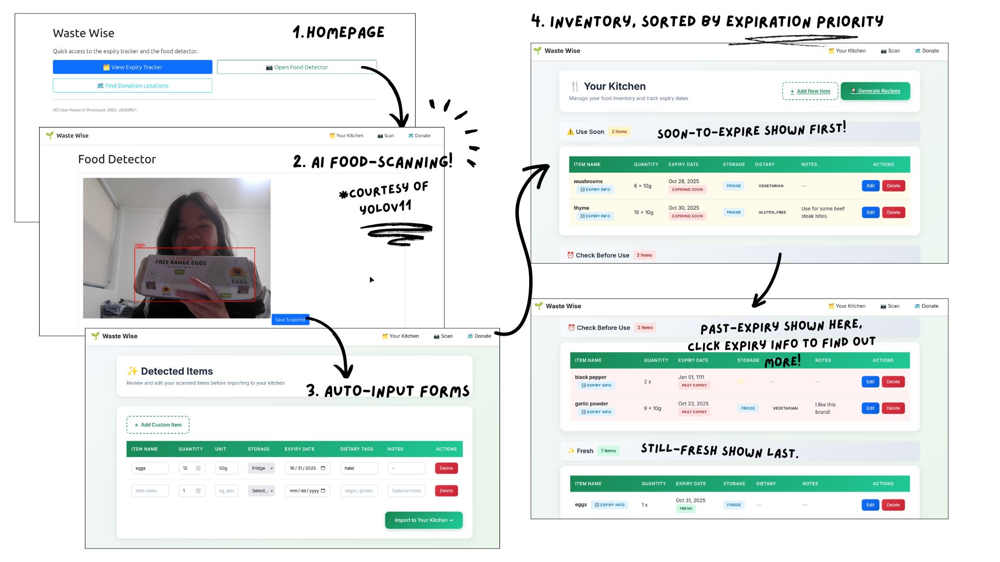

You can then input the details and this will go into your digital inventory - which is manually editable. The inventory is sorted by priority on which foods will expire soon, which are already past expiry, and which are still fresh. 

You can look into the expiry info of each food to see whether they could still be salvaged even if they've passed their expiry date. The app shows quality indicators to look out for in each type of food, so you can think twice before throwing it out.

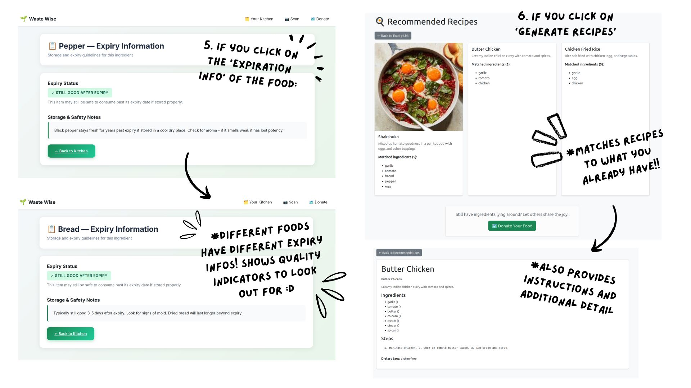

The 'Generate Recipes' button matches what you have in your digital inventory with a database of recipes to help you prep your meals and really use up what you already have in your kitchen. 

Still have a surplus even after that? Scroll down to 'Donate Your Food', and you'll see where you can go to spread the joy of eating to others in need. 

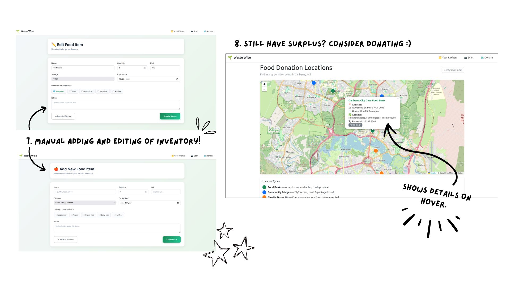

Due to lack of financing, I haven't been able to get WasteWise hosted on a public domain. You can find instructions on how to run it locally in materials/HCI_prototype/README.md.

## Research Data, Analysis and Findings

### Quantitative Analysis 

#### Model Performance 

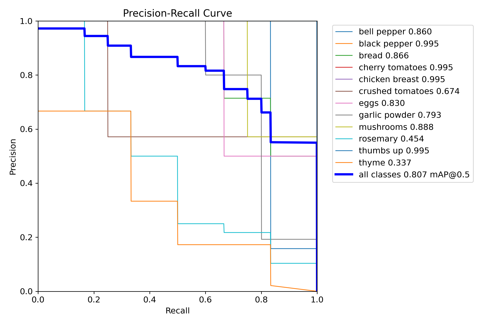

This Precision-Recall curve shows the detection performance for multiple object classes. Most classes achieve high precision and recall, while a few classes such as thyme (0.337)perform poorly. The overall mean Average Precision (mAP@0.5) of 0.807 suggests strong model performance but with variability depending on the object type. 

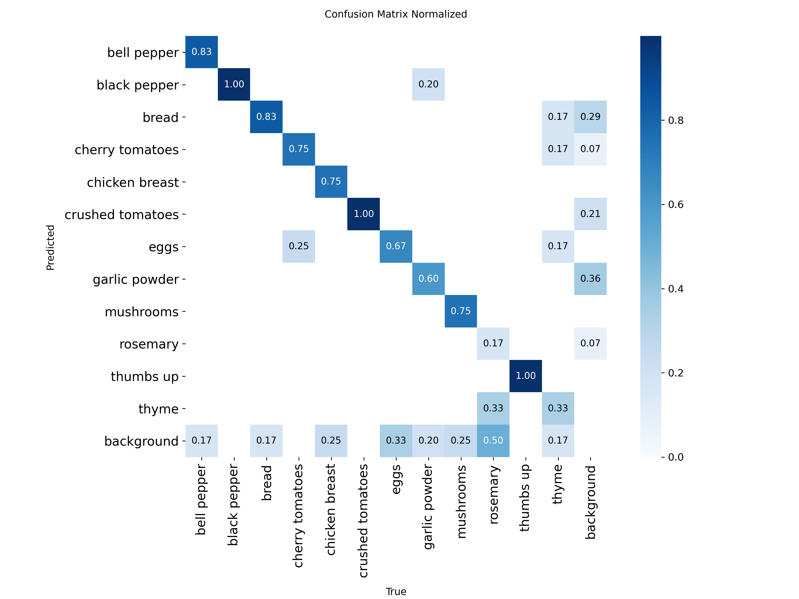
The confusion matrix supports these results by showing most classes have strong diagonal values indicating correct classifications, but visually similar or small objects like rosemary, eggs and thyme are once again often miscategorized.

#### SUS Score

In benchmarking the SUS, we compare the mean to the score 68 (α = 0.05) [5]:

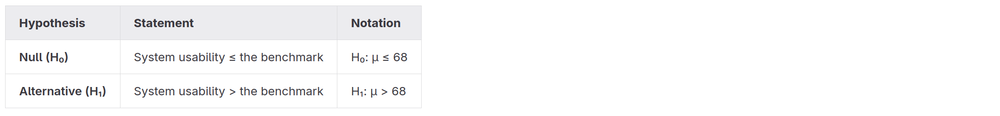

Mean SUS: 85.50 (std: 11.91, t: 3.29, one-sided p: 0.0152)

Since p = 0.0152 < α = 0.05, we reject the null hypothesis. The prototype’s usability is better than what is considered average for general systems.
We also obtain the Cohen's d value [6] vs benchmark as 1.47, indicating the usability improvement is substantial, not just statistically significant.
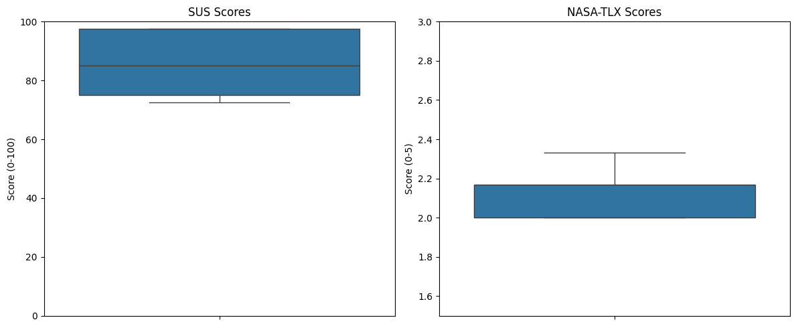

#### NASA-TLX index
The mean RAW NASA-TLX index approximates to 2 (out of 7), which indicates a low workload in using the task. Dimensions which scored the highest workloads were Mental Demand (2.6), Temporal Demand and Effort (2.4). Implications further discussed in 'Practical Usefulness in Everyday Life'.
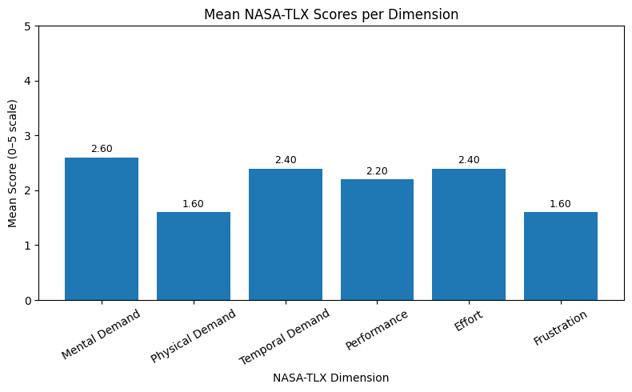

#### Pre/Post-Task Comparisons
The Pre-Task survey comprised of questions Q1-Q7 while the Post-Task survey had all the questions from Q1-Q10 along with SUS and NASA-TLX.

#### Inventory Awareness
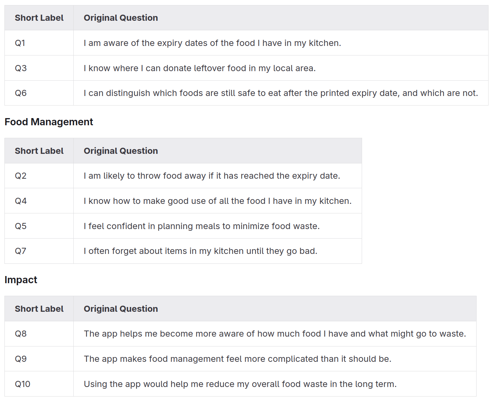

After reverse scaling and taking the mean of each subheading, the pre- vs post-task results suggest that the prototype had a strong impact on inventory awareness while changes in broader food management behaviors were positive but less conclusive. 

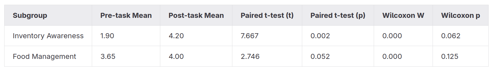

For Inventory Awareness, the mean score increased, and the paired t-test shows p = 0.002: a statistically significant improvement in awareness of expiry dates, donation options, and ability to distinguish safe foods. The Wilcoxon signed-rank test [7], a non-parametric test that does not assume the data follows a normal distribution, gives p = 0.062, suggesting a similar trend but slightly weaker evidence under the non-parametric assumption. For Food Management, the mean also increased, with the t-test yielding p = 0.052, a marginally non-significant result, and the Wilcoxon p = 0.125, confirming no strong evidence of change when relaxing normality assumptions. 

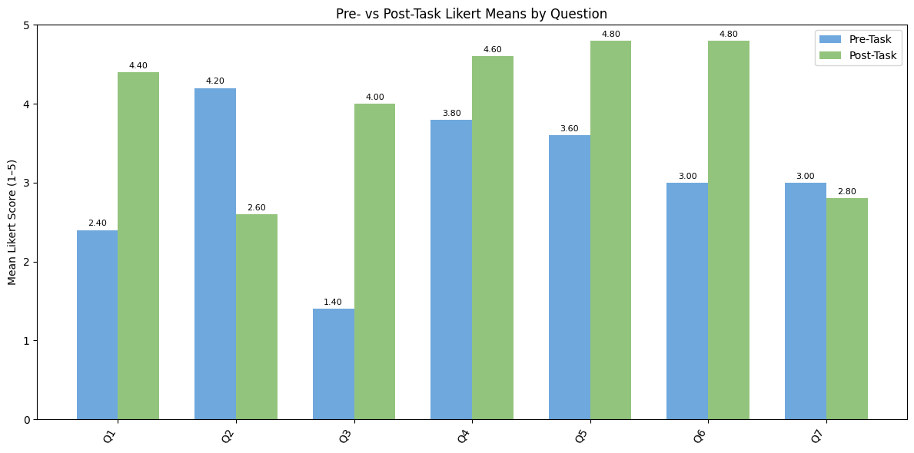

The post-task Impact questions shows a high mean score of 4.53 out of 5, indicating that participants perceived the AI-assisted food management prototype as highly effective in raising their awareness and guiding their behavior regarding food waste.

### Qualitative Analysis 
Thematic analysis was conducted following the methodology outlined in Naeem et al. (2023) [8], the full process visible on the Miro link in materials/README.md. All interviews were first recorded then transcribed. Themes discussed below.

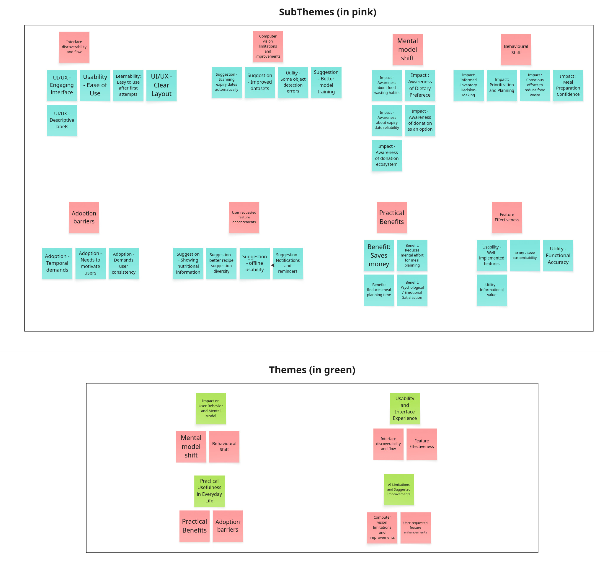

#### Sustainability Impact on Users' Behaviours and Mental Model
The prototype fostered meaningful cognitive shifts in participants’ attitudes toward food management and waste. Participants reported a newfound understanding of expiry dates, realizing “some foods are still safe to eat after their expiry date” and that “best before” labels could relate to quality rather than safety. In P4's words: “It's an eye-opener — it helps me think more about managing food before it expires.” The app also raises awareness towards lesser known methods of dealing with surplus, as P5 says, "I didn’t even know donating was an option, and this app even includes the places I can go to if I ever want to donate."  

On a behavioral level, participants said the app would increase confidence and intentionality in managing food. The recipe generation feature empowered less experienced cooks to creatively utilize ingredients they already had. According to P5: “I’m not a good cook. This helps a lot for making meals with what I already have.” The inventory and prioritization tools prompted proactive planning, with users noting how the app “helped them keep track of what to use first (P3)” and “think twice before throwing out expired food. (P1)”  It should be of note that the quantitative analysis showed non-significant (but positive) differences for changes in Food Management Behaviour. The observed behavioral shifts are promising but require further study with a larger sample to confirm their statistical robustness.

#### Usability and Interface Experience

Participants said that the interface was easy to use and pick up, and had engaging methods of input. According to P5, the way the application picks up on human gestures (thumbs-up) during the scanning process makes input a lot funner. Participants also noted that the inventory page had descriptive labels that helped them notice which foods to prioritize in one look (P1). This is in line with the good SUS score (mean = 85.5, p = 0.0152).

#### Practical Usefulness in Everyday Life

Users noted the prototype offered tangible benefits beyond food organization. A participant highlighted sustainable behaviours would help them save more money (P1). Users also described a psychological or emotional satisfaction associated with using the system, with one remarking that it “felt generally good for (my) conscience (P4).” Some barriers to adoption were also identified: consistent use requires temporal investment and motivation, meaning that the app’s full potential hinges on routine use. These are consistent with the results of the NASA-TLX, which showed that the app required higher mental and temporal demand and efforts.

#### AI Limitations and Suggested Improvements

In terms of computer vision, issues such as inaccurate object detection and misidentification were noted (which ties in with our model training results), prompting suggestions for better model training, improved datasets, and automatic scanning of expiry dates. Users also requested additional features to enhance practical utility, including displaying nutritional information, offering a more diverse range of recipe suggestions, enabling offline use, and providing notifications or reminders.

## Acknowledgements

* ChatGPT - Writing skeletons, Code generation
* Otter AI - Transcription

## References

1. Australian Household Food Waste Research 2025. OZHarvest. Retrieved October 27, 2025 from <https://www.ozharvest.org/app/uploads/2025/08/Half-Eaten-Australian-Household-Food-Waste-Research-Report-2025.pdf>
2. The Sustainable Development Goals Report 2025 (United Nations). UNStats. Retrieved October 27, 2025 from <https://unstats.un.org/sdgs/report/2025/>
3. Goal 12 | Department of Economic and Social Affairs. sdgs.un. Retrieved October 27, 2025 from <http://sdgs.un.org/goals/goal12>
4. Posters: Supporting Design: Take it to the Next Stage: The Roles of. Stanford. Retrieved October 27, 2025 <https://hci.stanford.edu/courses/cs247/2011/readings/simsarian.pdf>
5. Student. Wikipedia. Retrieved October 27, 2025 from <https://en.wikipedia.org/wiki/Student%27s_t-test>
6. Cohens D: Definition, Using & Examples - Statistics By Jim. Statistics by Jim. Retrieved October 27, 2025 from <https://statisticsbyjim.com/basics/cohens-d/>
7. Wilcoxon Test: Definition in Statistics, Types, and Calculation. Investopedia. Retrieved October 27, 2025 from <https://www.investopedia.com/terms/w/wilcoxon-test.asp>
8. A Step-by-Step Process of Thematic Analysis to Develop a. SagePub. Retrieved October 27, 2025 from <https://journals.sagepub.com/doi/10.1177/16094069231205789>
